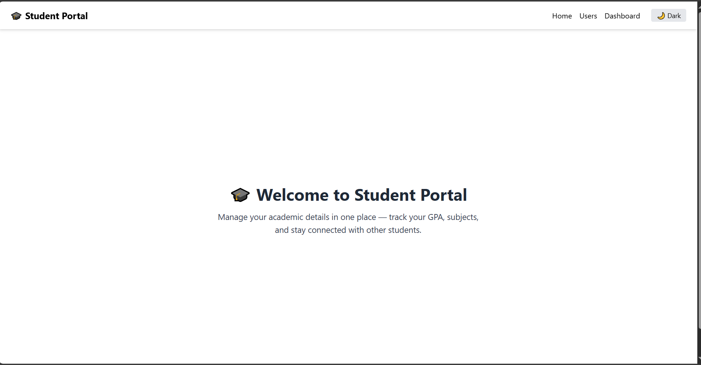
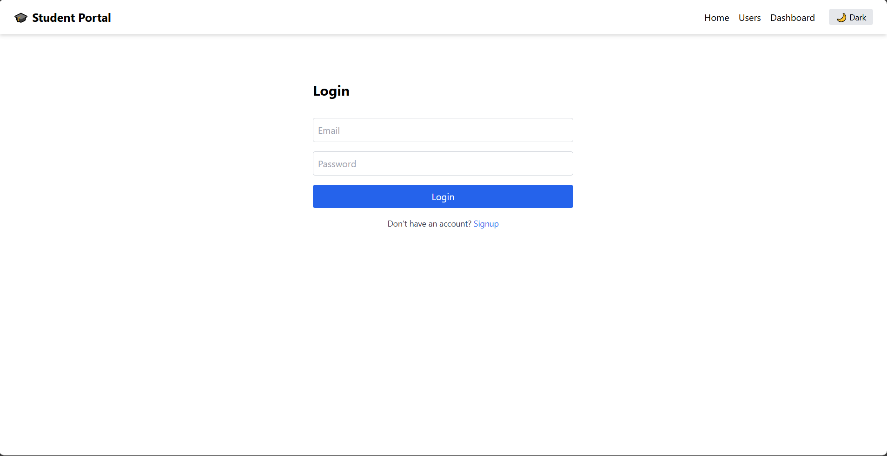
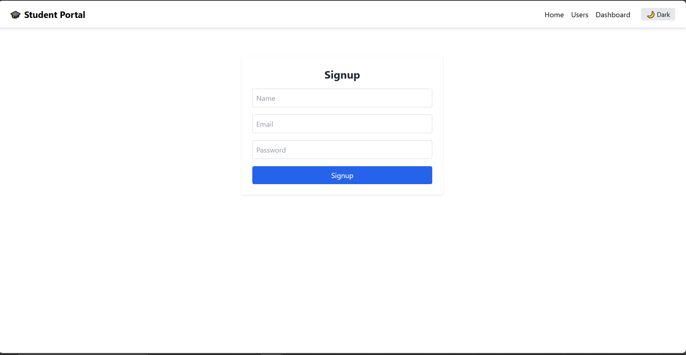
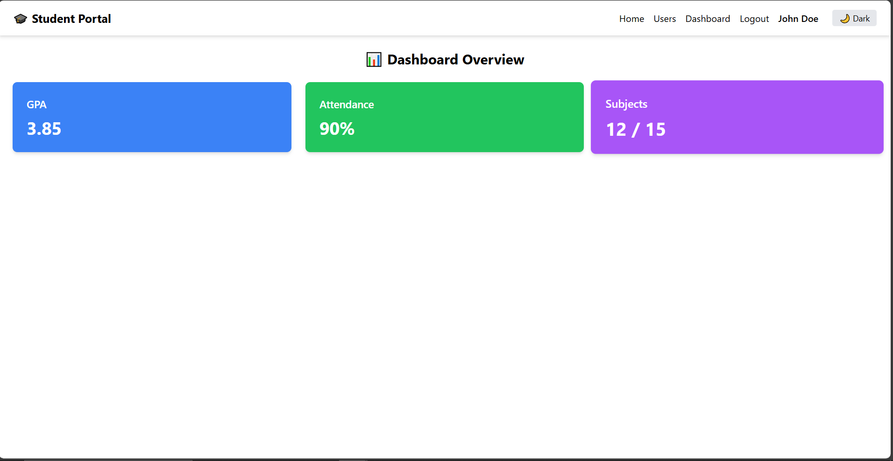
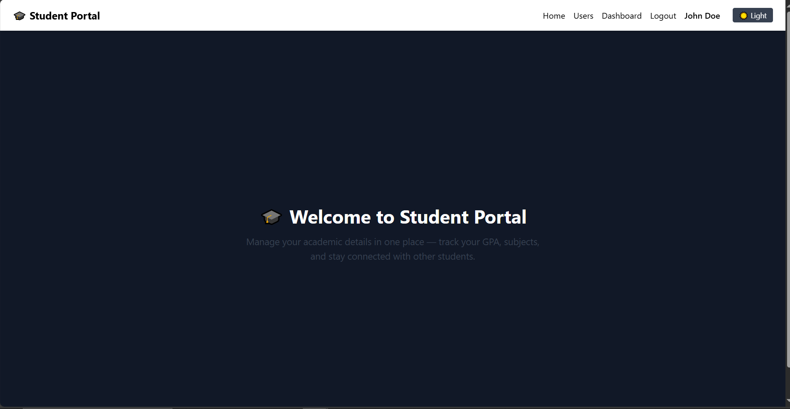

# Student Portal

A responsive and functional **Student Portal Web App** built using React, Tailwind CSS, and TypeScript. It includes login and logout, dashboard, API-based user listing, dark mode, and more.

## Live Demo

🔗 [Click here to view the app](https://student-portal-eight-beryl.vercel.app/)

## Features Implemented

- **Dummy Login** with hardcoded credentials
  - Email: `student@example.com`
  - Password: `123456`
- **Sticky Navbar** with routes
- **Home Page** with welcome message
- **Users Page** (API from jsonplaceholder)
- **Dashboard Page** with summary stats (GPA, Attendance, Subjects)
- **Dark Mode Toggle**
- **Logout** clears session
- **Optional Signup Page** (dummy form)
- Responsive design using Tailwind CSS
- Smooth hover transitions and UI polish

## Screenshots

## Tech Stack

- React + Vite + TypeScript
- React Router DOM
- Tailwind CSS
- Axios
- Vercel (for deployment)

## What I Learned / Challenges

- Setting up Tailwind manually with Vite & TypeScript
- Managing context-based dummy authentication
- Handling TypeScript isolated module errors
- Adding dark mode with Tailwind and syncing it with state
- Smooth component layout using Tailwind grid/flex

# Getting Started with Create React App

This project was bootstrapped with [Create React App](https://github.com/facebook/create-react-app).

## Available Scripts

In the project directory, you can run:

### `npm start`

Runs the app in the development mode.\
Open [http://localhost:3000](http://localhost:3000) to view it in the browser.

The page will reload if you make edits.\
You will also see any lint errors in the console.

### `npm test`

Launches the test runner in the interactive watch mode.\
See the section about [running tests](https://facebook.github.io/create-react-app/docs/running-tests) for more information.

### `npm run build`

Builds the app for production to the `build` folder.\
It correctly bundles React in production mode and optimizes the build for the best performance.

The build is minified and the filenames include the hashes.\
Your app is ready to be deployed!

See the section about [deployment](https://facebook.github.io/create-react-app/docs/deployment) for more information.

### `npm run eject`

**Note: this is a one-way operation. Once you `eject`, you can’t go back!**

If you aren’t satisfied with the build tool and configuration choices, you can `eject` at any time. This command will remove the single build dependency from your project.

Instead, it will copy all the configuration files and the transitive dependencies (webpack, Babel, ESLint, etc) right into your project so you have full control over them. All of the commands except `eject` will still work, but they will point to the copied scripts so you can tweak them. At this point you’re on your own.

You don’t have to ever use `eject`. The curated feature set is suitable for small and middle deployments, and you shouldn’t feel obligated to use this feature. However we understand that this tool wouldn’t be useful if you couldn’t customize it when you are ready for it.

## Learn More

You can learn more in the [Create React App documentation](https://facebook.github.io/create-react-app/docs/getting-started).

To learn React, check out the [React documentation](https://reactjs.org/).
